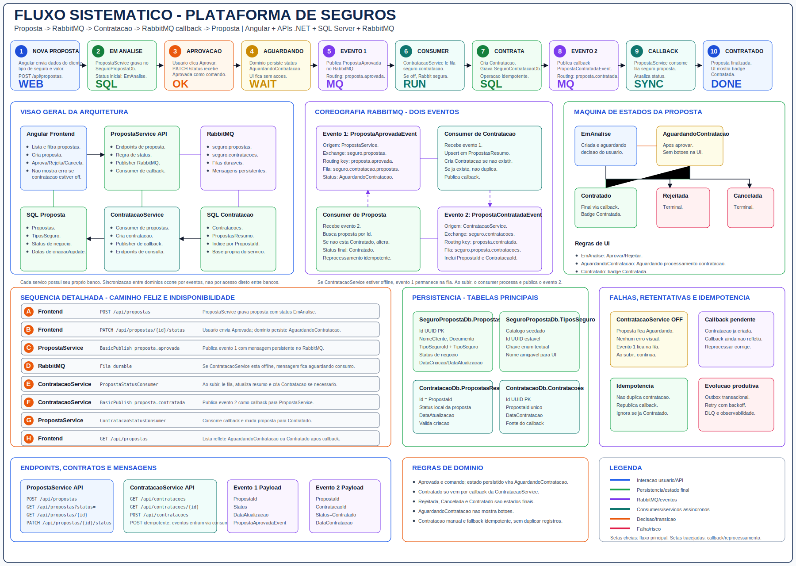

# Plataforma de Seguros

Plataforma demonstrativa para o ciclo de vida de propostas de seguro e contratacoes, usando frontend Angular, dois servicos .NET, SQL Server e RabbitMQ.

O ponto central do projeto e o fluxo assincrono entre proposta e contratacao:

- O usuario cria uma proposta.
- A proposta nasce em `EmAnalise`.
- Ao aprovar, a proposta nao vira `Contratado` imediatamente.
- A proposta passa para `AguardandoContratacao`.
- O `PropostaService` publica um evento no RabbitMQ.
- O `ContratacaoService` consome o evento e cria a contratacao.
- O `ContratacaoService` publica um callback/evento de retorno.
- O `PropostaService` consome esse callback e atualiza a proposta para `Contratado`.

Esse desenho permite que o servico de Contratacao fique temporariamente indisponivel sem quebrar a aprovacao da proposta. Enquanto a contratacao nao for processada, a tela mostra a proposta como `AguardandoContratacao` e nao oferece botoes de acao.

## Fluxo do Sistema



Documentacao detalhada:

- [SDD - System Design Document](docs/SDD.md)
- [Fluxo sistematico em SVG](docs/fluxo-sistematico-plataforma-seguro.svg)

## Tecnologias

- .NET 8
- ASP.NET Core
- MediatR
- Entity Framework Core
- SQL Server 2022
- RabbitMQ 3 Management
- Angular 18
- TypeScript
- RxJS
- Docker Compose
- Swagger/OpenAPI
- xUnit
- FluentAssertions

## Componentes

| Componente | Caminho | Responsabilidade |
| --- | --- | --- |
| Frontend | `front/seguro-web` | Interface web para criar, listar e acompanhar propostas |
| PropostaService | `back/src/PropostaService` | Dominio, API, persistencia e eventos de propostas |
| ContratacaoService | `back/src/ContratacaoService` | Dominio, API, persistencia e eventos de contratacoes |
| BuildingBlocks | `back/src/BuildingBlocks` | Contratos compartilhados de mensageria |
| Shared | `back/src/Shared` | Base comum de dominio |
| Tests | `back/tests` | Testes automatizados dos servicos |
| Docs | `docs` | SDD e diagramas |

## Arquitetura

O backend segue uma organizacao inspirada em DDD e arquitetura hexagonal.

Cada servico possui:

- `Api`: camada HTTP, controllers, configuracao de aplicacao e Swagger.
- `Application`: casos de uso, comandos, handlers e portas.
- `Domain`: entidades, enums e regras de negocio.
- `Infrastructure`: Entity Framework, repositories, publishers RabbitMQ e consumers RabbitMQ.

Separacao de responsabilidades:

- `PropostaService` e dono da proposta e do status da proposta.
- `ContratacaoService` e dono da contratacao.
- `RabbitMQ` transporta eventos entre os servicos.
- `SQL Server` armazena os dados transacionais.
- O frontend nao orquestra a comunicacao entre os servicos.

## Fluxo Assincrono Principal

```text
Usuario
  -> seguro-web
  -> PropostaService
  -> grava AguardandoContratacao
  -> publica PropostaAprovadaEvent
  -> RabbitMQ
  -> ContratacaoService
  -> cria Contratacao
  -> publica PropostaContratadaEvent
  -> RabbitMQ
  -> PropostaService
  -> grava Contratado
  -> seguro-web exibe Contratada
```

## Estados da Proposta

| Status | Significado | Acoes na tela |
| --- | --- | --- |
| `EmAnalise` | Proposta criada e aguardando decisao | Aprovar/Rejeitar |
| `AguardandoContratacao` | Proposta aprovada e aguardando consumer de contratacao | Sem botoes; exibe `Aguardando processamento contratacao` |
| `Contratado` | Contratacao concluida e callback recebido | Badge `Contratada` |
| `Rejeitada` | Proposta rejeitada | Sem acoes |
| `Cancelada` | Proposta cancelada | Sem acoes |

Regra importante:

```text
Aprovacao nao significa contratacao concluida.
Aprovacao inicia o processo.
Callback conclui o processo.
```

## Eventos RabbitMQ

O fluxo usa dois eventos principais.

| Evento | Producer | Exchange | Routing Key | Queue | Consumer |
| --- | --- | --- | --- | --- | --- |
| `PropostaAprovadaEvent` | PropostaService | `seguro.propostas` | `proposta.aprovada` | `seguro.contratacao.propostas` | ContratacaoService |
| `PropostaContratadaEvent` | ContratacaoService | `seguro.contratacoes` | `proposta.contratada` | `seguro.proposta.contratacoes` | PropostaService |

Eventos adicionais de status de proposta tambem existem para sincronizacao do resumo local no `ContratacaoService`:

- `PropostaRejeitadaEvent`
- `PropostaCanceladaEvent`

## Comportamento Quando ContratacaoService Esta Offline

Se o `ContratacaoService` estiver parado quando o usuario aprovar uma proposta:

1. O `PropostaService` continua funcionando.
2. A proposta muda para `AguardandoContratacao`.
3. O evento `PropostaAprovadaEvent` fica no RabbitMQ.
4. A tela nao mostra erro de servico indisponivel.
5. A tela nao mostra botoes para essa proposta.
6. Quando o `ContratacaoService` voltar, ele consome o evento.
7. A contratacao e criada.
8. O callback `PropostaContratadaEvent` atualiza a proposta para `Contratado`.

## Portas

| Servico | URL |
| --- | --- |
| Frontend Angular | `http://localhost:4200` |
| PropostaService | `http://localhost:5001` |
| ContratacaoService | `http://localhost:5002` |
| SQL Server | `localhost:1433` |
| RabbitMQ AMQP | `localhost:5672` |
| RabbitMQ Management | `http://localhost:15672` |

## Credenciais Locais

SQL Server:

| Campo | Valor |
| --- | --- |
| Usuario | `sa` |
| Senha | `Seguro@12345` |
| Database Propostas | `SeguroPropostaDb` |
| Database Contratacoes | `SeguroContratacaoDb` |

RabbitMQ:

| Campo | Valor |
| --- | --- |
| Usuario | `guest` |
| Senha | `guest` |

Connection strings usadas no Docker:

```text
Server=sqlserver,1433;Database=SeguroPropostaDb;User Id=sa;Password=Seguro@12345;TrustServerCertificate=True;Encrypt=False

Server=sqlserver,1433;Database=SeguroContratacaoDb;User Id=sa;Password=Seguro@12345;TrustServerCertificate=True;Encrypt=False
```

## URLs Uteis

| Recurso | URL |
| --- | --- |
| Frontend | `http://localhost:4200` |
| Swagger Propostas | `http://localhost:5001/swagger` |
| Swagger Contratacoes | `http://localhost:5002/swagger` |
| Health Propostas | `http://localhost:5001/health` |
| Health Contratacoes | `http://localhost:5002/health` |
| Tipos de Seguro | `http://localhost:5001/api/tipos-seguro` |
| RabbitMQ Management | `http://localhost:15672` |

## Como Rodar com Docker

Na raiz do projeto:

```powershell
docker compose -f back\docker-compose.yml up --build -d
```

Verificar containers:

```powershell
docker compose -f back\docker-compose.yml ps
```

Ver logs do PropostaService:

```powershell
docker logs --tail 120 proposta-api
```

Ver logs do ContratacaoService:

```powershell
docker logs --tail 120 contratacao-api
```

Parar a stack:

```powershell
docker compose -f back\docker-compose.yml down
```

## Como Rodar o Frontend

Em outro terminal:

```powershell
cd front\seguro-web
npm.cmd install
npm.cmd start
```

Acessar:

```text
http://localhost:4200
```

O frontend chama diretamente:

- `http://localhost:5001/api/propostas`
- `http://localhost:5001/api/tipos-seguro`
- `http://localhost:5002/api/contratacoes`

## Como Rodar Backend Local sem Docker

Subir a infraestrutura com Docker:

```powershell
docker compose -f back\docker-compose.yml up -d sqlserver rabbitmq
```

Restaurar pacotes:

```powershell
dotnet restore back\SeguroPlataforma.sln --configfile NuGet.Config
```

Aplicar migrations:

```powershell
dotnet ef database update --project back\src\PropostaService\PropostaService.Infrastructure\PropostaService.Infrastructure.csproj --startup-project back\src\PropostaService\PropostaService.Api\PropostaService.Api.csproj --context PropostaDbContext

dotnet ef database update --project back\src\ContratacaoService\ContratacaoService.Infrastructure\ContratacaoService.Infrastructure.csproj --startup-project back\src\ContratacaoService\ContratacaoService.Api\ContratacaoService.Api.csproj --context ContratacaoDbContext
```

Rodar PropostaService:

```powershell
dotnet run --project back\src\PropostaService\PropostaService.Api\PropostaService.Api.csproj --urls http://localhost:5001
```

Rodar ContratacaoService:

```powershell
dotnet run --project back\src\ContratacaoService\ContratacaoService.Api\ContratacaoService.Api.csproj --urls http://localhost:5002
```

Observacao:

As APIs aplicam migrations automaticamente na inicializacao via `MigrateAsync()`. Os comandos de `dotnet ef database update` sao uteis quando se deseja controlar ou validar a atualizacao manualmente.

## Como Validar

Restaurar:

```powershell
dotnet restore back\SeguroPlataforma.sln --configfile NuGet.Config
```

Compilar backend:

```powershell
dotnet build back\SeguroPlataforma.sln --no-restore
```

Testar backend:

```powershell
dotnet test back\SeguroPlataforma.sln --no-build
```

Compilar frontend:

```powershell
cd front\seguro-web
npm.cmd run build
```

Observacao:

O projeto Angular ainda nao possui target de teste automatizado configurado para execucao util neste fluxo. O comando principal de validacao do frontend e o build.

## Roteiro de Validacao Manual

### Fluxo feliz

1. Subir Docker Compose.
2. Subir frontend.
3. Abrir `http://localhost:4200`.
4. Criar uma proposta.
5. Confirmar status `EmAnalise`.
6. Aprovar/contratar a proposta.
7. Confirmar status `AguardandoContratacao`.
8. Aguardar processamento.
9. Confirmar status `Contratado`.

### ContratacaoService offline

1. Subir Docker Compose.
2. Parar apenas o container de contratacao:

```powershell
docker compose -f back\docker-compose.yml stop contratacao-api
```

3. Criar uma proposta.
4. Aprovar a proposta.
5. Confirmar que a proposta fica em `AguardandoContratacao`.
6. Confirmar que a tela nao mostra botoes de acao.
7. Confirmar que a tela nao mostra erro de indisponibilidade.
8. Subir novamente o container:

```powershell
docker compose -f back\docker-compose.yml up -d contratacao-api
```

9. Aguardar o consumer processar a fila.
10. Confirmar que a proposta muda para `Contratado`.

## Estrutura Principal

```text
.
|-- README.md
|-- NuGet.Config
|-- back/
|   |-- SeguroPlataforma.sln
|   |-- docker-compose.yml
|   |-- src/
|   |   |-- BuildingBlocks/
|   |   |   `-- Messaging/
|   |   |-- Shared/
|   |   |   `-- BaseComum/
|   |   |-- PropostaService/
|   |   |   |-- PropostaService.Api/
|   |   |   |-- PropostaService.Application/
|   |   |   |-- PropostaService.Domain/
|   |   |   `-- PropostaService.Infrastructure/
|   |   `-- ContratacaoService/
|   |       |-- ContratacaoService.Api/
|   |       |-- ContratacaoService.Application/
|   |       |-- ContratacaoService.Domain/
|   |       `-- ContratacaoService.Infrastructure/
|   `-- tests/
|       |-- Propostas/
|       `-- Contratacao/
|-- front/
|   `-- seguro-web/
|       |-- angular.json
|       |-- package.json
|       `-- src/
|           `-- app/
`-- docs/
    |-- SDD.md
    `-- fluxo-sistematico-plataforma-seguro.svg
```

## Detalhamento Tecnico

### PropostaService

Responsabilidades:

- Criar propostas.
- Listar e filtrar propostas.
- Consultar tipos de seguro.
- Alterar status da proposta.
- Publicar eventos de status de proposta.
- Consumir callback de contratacao concluida.
- Atualizar proposta para `Contratado`.

Principais regras:

- Proposta nova entra como `EmAnalise`.
- Aprovacao altera para `AguardandoContratacao`.
- `Contratado` deve ser aplicado por callback/evento.
- Proposta em `AguardandoContratacao` nao deve ter acao de contratar novamente na UI.

### ContratacaoService

Responsabilidades:

- Consumir eventos de proposta.
- Manter resumo local de propostas.
- Criar contratacao.
- Garantir idempotencia por `PropostaId`.
- Publicar callback de proposta contratada.

Principais regras:

- Nao criar duas contratacoes para a mesma proposta.
- Se a contratacao ja existir, republicar callback quando necessario.
- Consumir `PropostaAprovadaEvent` para iniciar contratacao.

### RabbitMQ

Responsabilidades:

- Desacoplar os servicos.
- Manter eventos pendentes enquanto consumers estiverem indisponiveis.
- Permitir retomada automatica do processamento.

Topologia principal:

```text
seguro.propostas
  routing: proposta.aprovada
  queue: seguro.contratacao.propostas
  consumer: ContratacaoService

seguro.contratacoes
  routing: proposta.contratada
  queue: seguro.proposta.contratacoes
  consumer: PropostaService
```

### SQL Server

Bancos:

- `SeguroPropostaDb`
- `SeguroContratacaoDb`

O desenho evita que um servico grave diretamente no banco do outro. Cada servico possui seu proprio modelo e se comunica por eventos.

## Principais Endpoints

### Propostas

| Metodo | Endpoint | Descricao |
| --- | --- | --- |
| `GET` | `/api/propostas` | Lista propostas |
| `GET` | `/api/propostas/{id}` | Consulta proposta por id |
| `POST` | `/api/propostas` | Cria proposta |
| `PATCH` | `/api/propostas/{id}/status` | Altera status |
| `GET` | `/api/tipos-seguro` | Lista tipos de seguro |

### Contratacoes

| Metodo | Endpoint | Descricao |
| --- | --- | --- |
| `GET` | `/api/contratacoes` | Lista contratacoes |
| `GET` | `/api/contratacoes/{id}` | Consulta contratacao por id |
| `POST` | `/api/contratacoes` | Cria contratacao de forma idempotente |

## Decisoes Importantes

- O frontend nao deve chamar endpoint interno para sincronizar eventos entre servicos.
- O status `AguardandoContratacao` representa processamento assincrono real.
- O status `Contratado` depende do callback do `ContratacaoService`.
- A indisponibilidade do `ContratacaoService` nao deve aparecer como erro funcional para o usuario.
- RabbitMQ e a ponte oficial entre os servicos.
- Idempotencia por `PropostaId` evita duplicidade de contratacao.

## Melhorias Futuras

- Outbox transacional no PropostaService.
- Outbox transacional no ContratacaoService.
- Dead-letter queues para eventos com falha.
- Correlation id nos eventos e logs.
- Versionamento de contratos de eventos.
- Painel tecnico para mensagens pendentes.
- Alertas para propostas presas em `AguardandoContratacao`.
- Testes E2E do fluxo completo.

## Referencias

- [SDD detalhado](docs/SDD.md)
- [Diagrama do fluxo](docs/fluxo-sistematico-plataforma-seguro.svg)
